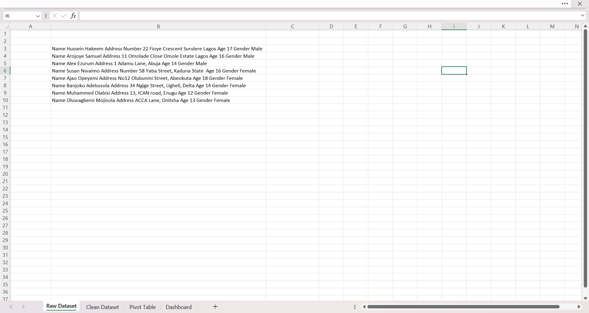
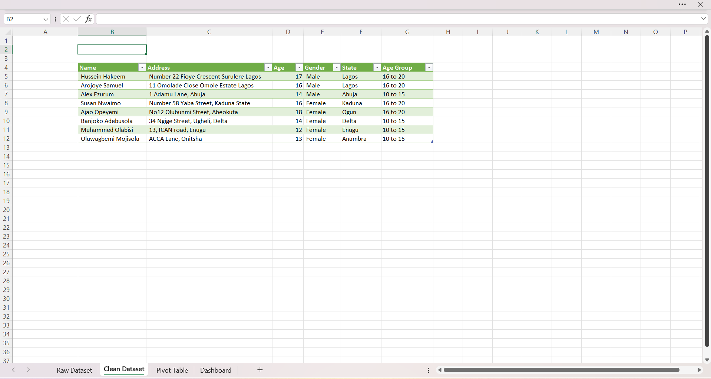
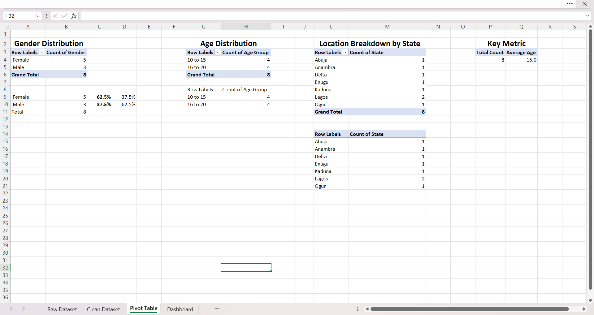
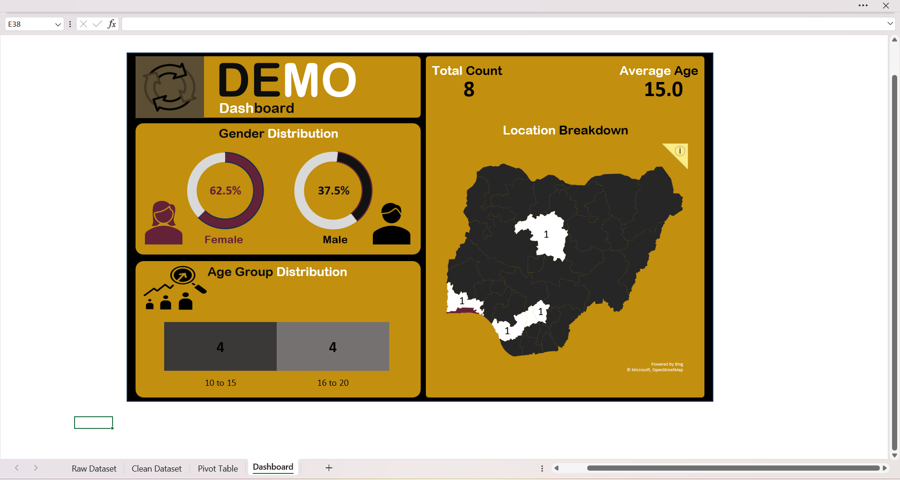

# Customer Data Analysis

This project demonstrates basic data cleaning, analysis, and visualization using Excel.

---

## 📊 Project Overview
- Cleaned raw data using Power Query  
- Performed analysis using pivot tables  
- Built a simple dashboard for insights  

---

## 🛠️ Tools & Techniques
- Microsoft Excel (data analysis, pivot tables, dashboard creation)
- Power Query (data cleaning and transformation)

---

## 📁 Files
- customer_analysis_dashboard.xlsx

---

## 📸 Screenshots

### Raw Dataset

### Clean Dataset

### Pivot Table Analysis

### Dashboard

